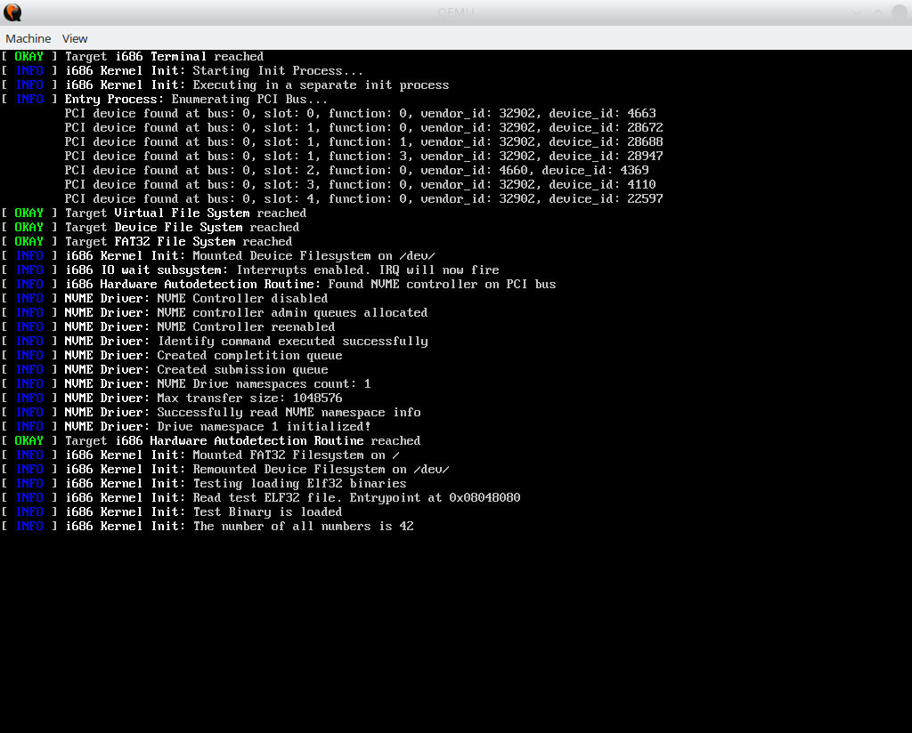

# CPL-1 Operating System


[](https://frontend.code-inspector.com/project/16615/dashboard)



*CPL-1 kernel init log on i686 CPUs*

### Discord server

CPL-1 has its own discord server.

Server invite: https://discord.gg/SXnE5aSfhN

### What is CPL-1

CPL-1 Operating System is a hobby operating system project with the goal of creating lightweight and portable operating system that can build itself. It is called like that as the kernel for i686 target runs in ring 1 to avoid variable length interrupt frames (previously CPL-1 was only for i686 processors, so that was quite influential).

### What targets are supported by CPL-1

Currently there is only support for i686 CPUS with PIC 8259 interrupt controller and PCI configuration space access mechianism v1.0

### Features

* Process Subsystem
* Virtual File System
* NVMe controllers driver
* FAT32 readonly filesystem support
* Basic userspace support (open/read/write/close system calls) 

### What I need to build CPL-1?

To build CPL-1 kernel for i686 target, you need to build GCC cross-compiler for ```i686-elf``` target (don't forget to add to PATH) and install NASM. Additionally, GNU Make, parted, mkdosfs, partprobe should be present and loopback devices should be enabled in the kernel.

Also, you might want python3 to run inotify helper, but that is optional, as kernel compile times are quite low atm.

### How I build CPL-1?

#### Cloning limine

CPL-1 uses limine bootloader ("https://github.com/limine-bootloader/limine"). It should be cloned together with this repo if you use --recursive option

#### Source watcher

Source watcher automatically deletes object files when you edit corresponding source files. This allows to decrease build times, as only files that you have edited are recompiled

You can run source watcher from repository root with
```bash
python3 inotify-object-delete.py
```

#### Building system for i686

Go to ```./build/i686/```

To build system, run
```bash
make
```

To build system without cleaning up, run
```
make build
```

To run system, run
```bash
make run
```

To debug system, run
```bash
make debug
```

To cleanup object files (if you are not using source watcher for some reason), run
```bash
make clean
```

To do ```make``` and ```make run`` in a single command, run
```bash
make testrun
```

To do ```make`` and ```make debug``` in a single command, run
```bash
make testdebug
```

### Licensing

CPL-1 uses MIT license. In short, it means that you need to cite this codebase if you are planning to use code from this repository. Don't quote me on this though.