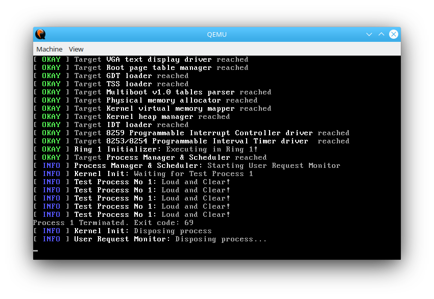

# CPL-1 Operating System


*CPL-1 kernel process subsystem test*

### What is CPL-1

CPL-1 Operating System is a hobby operating system project with the goal of creating small operating system that can build itself. It is called like that as the kernel runs in ring 1 to avoid variable length interrupt frames.

### Why CPL-1 is 32 bit only?

CPL-1 is written to run in protected mode. Why? The answer is simple: I have never written 32 bit OSes before, so I decided to find out whether writing 32 bit OSes is really more simple (spoiler: it is not).

### What I need to build CPL-1?

CPL-1 uses gcc, libgcc, ld, nasm and GNU Make to build. 

For NixOS, I simply type ```nix-shell -p pkgsi686Linux.gcc pkgsi686Linux.libgcc nasm``` before doing any development

### How I build CPL-1?

#### CPL-1 Kernel

Start with
```
cd kernel
```

To build kernel
```
make
```
To clean object files
```
make object_clean
```
To clean everything (including kernel.elf file)
```
make clean
```
To build and run kernel with ```-kernel``` QEMU switch
```
make run
```

### What CPL-1 is licensed under?

CPL-1 uses MIT license. In short, it means that you need to cite this codebase if you are planning to use code from this repository. Don't quote me on this though.