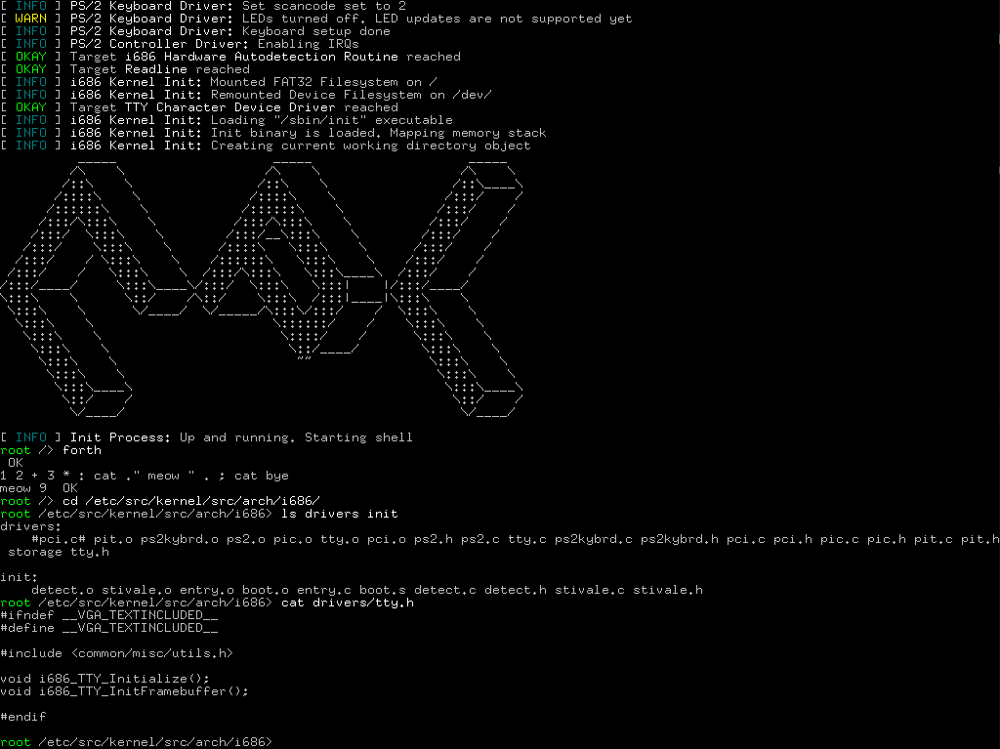

# CPL-1 Operating System


*CPL-1 kernel init log on i686 CPUs*

### What is CPL-1

CPL-1 Operating System is a hobby operating system project with the goal of creating lightweight and portable operating system that can build itself. It is called like that as the kernel for i686 target runs in ring 1 to avoid variable length interrupt frames (previously CPL-1 was only for i686 processors, so that was quite influential).

### What targets are supported by CPL-1

Currently there is only support for i686 CPUS with PIC 8259 interrupt controller and PCI configuration space access mechianism v1.0

### What I need to build CPL-1?

The following dependencies should be met to build CPL-1 for i686 target
```
bash # All scripts use BASH to run
i686-elf-gcc # GNU C cross compiler for i686 target, build instructions here: https://wiki.osdev.org/GCC_Cross-Compiler
nasm # Netwide Assembler - assembler with intel syntax.
chronic # from moreutils, displays output only if error occured
make # GNU Make build system
losetup # Used to modify kernel image
fdisk # Partitioning program, used to make OS image
mkfs.fat # from dosfstools, used to format partitions on kernel image as FAT32 
python3 # CPython 3 interpreter. Used to run source watcher. Optional
qemu-system-i386 # QEMU emulator for i386 target. Used for testing purposes. Optional
```

Additionally, you might need python3 to run inotify helper, but that is optional.

### How I build CPL-1?

#### Source watcher

Source watcher automatically deletes object files when you edit corresponding source files. This allows to decrease build times, as only files that you have edited are recompiled

You can run source watcher from repository root with
```bash
python3 inotify-object-delete.py
```

#### Building system for i686

Go to ```./build/i686/```

To build system, run
```bash
./build.sh
```

To run system, run
```bash
./run.sh
```

To debug system, run
```bash
./debug.sh
```

To cleanup object files (if you are not using source watcher for some reason), run
```bash
./clean.sh
```

### What CPL-1 is licensed under?

CPL-1 uses MIT license. In short, it means that you need to cite this codebase if you are planning to use code from this repository. Don't quote me on this though.